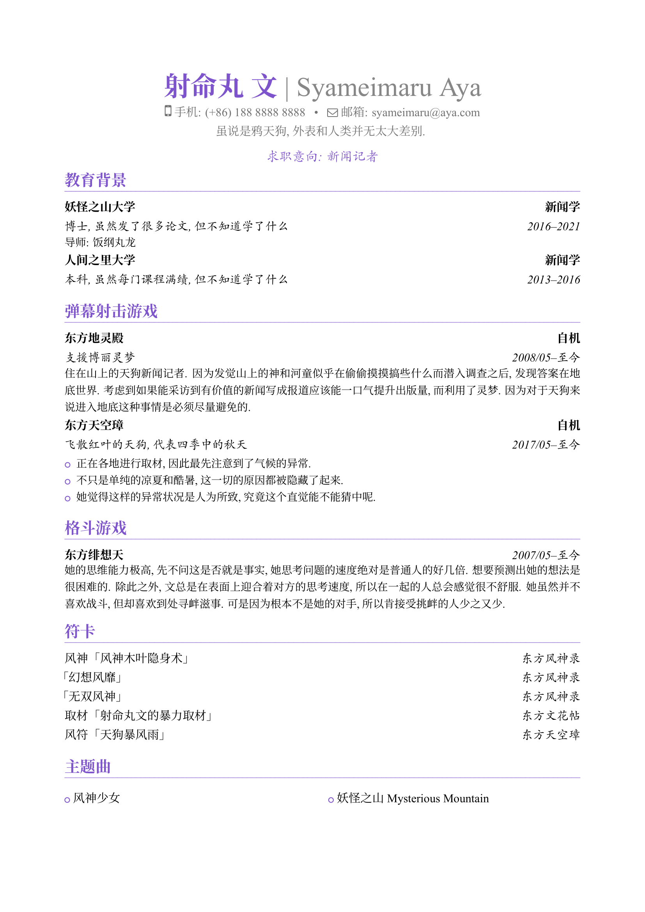

# AyaCV: LaTeX中文简历模板

基于 [ModernCV](https://github.com/xdanaux/moderncv) 模板的 banking 主题修改，对格式略作调整，添加了中文支持。

在使用该模板时，建议安装[思源宋体](https://github.com/adobe-fonts/source-han-serif/tree/release/)，个人认为比系统自带的字体好看很多。

编译器使用 XeLaTeX。该模板在 Windows 系统上使用 TeX Live 2020 版本能够通过编译，其他环境没测过。~~毕竟是在找实习的时候临时做的一份模板。有问题再修吧。~~

模板用法都在 `ayacv.tex` 的注释中，建议同时参考 [ModernCV](https://github.com/xdanaux/moderncv) 的用法。

预览图：

